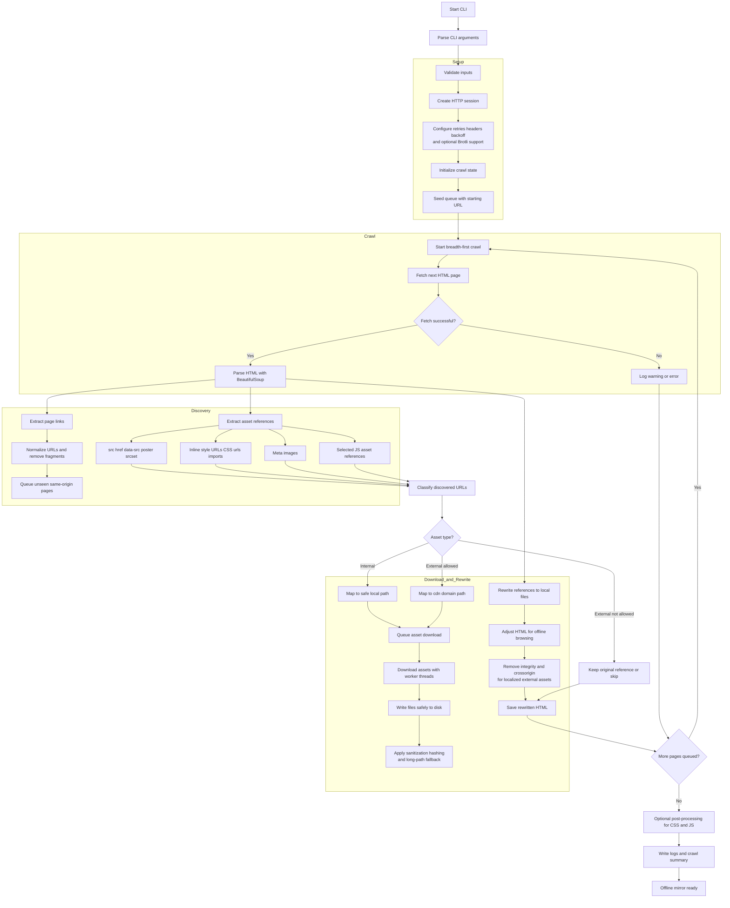

# 🌐 Website Downloader CLI

[](https://github.com/PKHarsimran/website-downloader/actions/workflows/python-app.yml)
[](https://github.com/PKHarsimran/website-downloader/actions/workflows/lint.yml)
[](https://opensource.org/licenses/MIT)
[](https://www.python.org/)
[](https://github.com/psf/black)

Website Downloader CLI is a lightweight, pure-Python website mirroring tool that creates a browsable offline copy of a site by crawling pages, downloading assets, and rewriting references to local files.

It is designed for clean offline browsing, lab testing, archiving, and migration scenarios where you want a local copy of a public site or portal structure.

> Great for web archiving, offline backups, pentesting labs, migration prep, and reviewing a site without an internet connection.

---

## ✨ Features

- Recursively crawls same-origin HTML pages
- Downloads internal assets such as:
  - images
  - CSS
  - JavaScript
  - fonts
  - media files
  - manifests and web assets
- Rewrites offline references for:
  - `<a href>`
  - ``
  - `<script src>`
  - `<link href>`
  - `data-src`
  - `poster`
  - `srcset`
  - inline `style="url(...)"`
  - inline `<style>` blocks
  - CSS `url(...)` and `@import`
  - common static asset URLs inside JS strings
- Optional external asset downloading for CDN/off-site resources
- Supports domain whitelisting for controlled external downloads
- Stores external resources under `cdn/<domain>/...`
- Supports authenticated crawling with `--cookie` and `--cookie-file`
- Handles protocol-relative URLs like `//cdn.example.com/file.css`
- Rewrites social preview assets like `og:image` and `twitter:image`
- Removes problematic `integrity` and `crossorigin` attributes when external assets are localized
- Safely skips non-fetchable schemes like:
  - `mailto:`
  - `tel:`
  - `sms:`
  - `javascript:`
  - `data:`
  - `geo:`
  - `blob:`
  - `about:`
- Uses retry and backoff for unstable connections
- Downloads assets concurrently with worker threads
- Hardens paths with sanitization, hashing, and long-path fallbacks

---

## ❤️ Support This Project

If you find this tool useful, consider supporting the project:

[Donate via PayPal](https://www.paypal.com/donate/?business=MVEWG3QAX6UBC&no_recurring=1&item_name=Github+Project+-+Website+downloader&currency_code=CAD)

---

## 🚀 Quick Start

```bash
# 1. Clone the repo
git clone https://github.com/PKHarsimran/website-downloader.git
cd website-downloader

# 2. Install dependencies
pip install -r requirements.txt

# 3. Mirror a site
python website-downloader.py \
    --url https://example.com \
    --destination example_backup \
    --max-pages 100 \
    --threads 8

# 4. Mirror a protected site using a cookie file
python website-downloader.py \
  --url https://intranet.example.com \
  --destination example_backup \
  --cookie-file example-cookie.txt
```

The sample cookie file uses simple header syntax:

```text
sessionid=abc123; csrftoken=xyz789
```

You can rename `example-cookie.txt` to any other file name if you prefer. The downloader reads the cookie values from that file and sends them with the crawl session.

---

## 🛠️ Libraries Used

| Library | Purpose |
|----------|----------|
| **requests** + **urllib3.Retry** | Handles HTTP downloads with session reuse, retry support, and backoff for unstable connections |
| **BeautifulSoup (bs4)** | Parses HTML and extracts links, assets, metadata, and crawl targets from tags like `<a>`, ``, `<script>`, `<link>`, and `<meta>` |
| **argparse** | Provides CLI argument parsing and validation for flags like `--url`, `--threads`, `--max-pages`, and external asset options |
| **logging** | Provides structured console and file logging for crawl progress, warnings, errors, and summary information |
| **threading** & **queue** | Powers concurrent downloading of assets through a worker-thread queue model |
| **pathlib** & **os** | Manages filesystem-safe output paths, directory creation, and cross-platform file writing |
| **urllib.parse** | Resolves relative URLs, normalizes paths, strips fragments, and helps rewrite links safely for offline browsing |
| **hashlib (sha256)** | Generates stable hashed filenames when paths are too long or query strings could cause filename collisions |
| **posixpath** | Normalizes URL-style paths consistently while helping prevent malformed or unsafe path construction |
| **time** | Measures crawl timing and runtime performance |
| **sys** | Handles CLI exits and runtime stream control |
| **re** | Supports path cleanup, filename normalization, CSS/JS asset extraction, and malformed multi-dot filename cleanup |

## 🗂️ Project Structure

| Path | What it is | Key features |
|------|------------|--------------|
| `website-downloader.py` | **Main CLI script** that handles crawling, downloading, and offline link rewriting. | • Shared `requests.Session` with retry and backoff handling<br>• Breadth-first crawl controlled by `--max-pages`<br>• Worker-thread queue for concurrent asset downloads via `--threads`<br>• Rewrites internal links for offline browsing<br>• Supports external asset downloading and domain whitelisting<br>• Handles CSS, inline styles, `srcset`, meta images, and selected JS asset references |
| `requirements.txt` | Minimal runtime dependency list for the project. | • Includes only core third-party packages needed to run the downloader<br>• Keeps installation simple and lightweight |
| `web_scraper.log` | Auto-generated runtime log file created during execution. | • Captures crawl progress, warnings, errors, and summary details<br>• Useful for troubleshooting failed downloads or rewrite issues |
| `example-cookie.txt` | Sample cookie file for authenticated crawling. | • Shows the expected `name=value; name2=value2` format for `--cookie-file` |
| `README.md` | Project documentation and usage guide. | • Covers installation, usage examples, features, flags, and behavior notes |
| *(output folder)* | Generated at runtime to store the mirrored website locally. | • Saves HTML pages, internal assets, and optionally external CDN assets<br>• Preserves a browsable offline structure such as `index.html`, subfolders, and `cdn/<domain>/...` paths |

> **Removed:** The old `check_download.py` verifier is no longer required because the new downloader performs integrity checks (missing files, broken internal links) during the crawl and reports any issues directly in the log summary.

## 🧭 How the Script Works



## ✨ Recent Improvements

### ✅ Type Conversion Fix
Resolved a `TypeError` caused by `int(..., 10)` when non-string arguments were passed, improving argument handling and CLI reliability.

### ✅ Safer Path Handling
Added path shortening, sanitization, and hashed fallbacks to prevent long-path and invalid filename issues across different operating systems.

### ✅ Improved CLI Experience
Improved argument parsing and validation with `argparse`, making the tool easier to run and error messages clearer.

### ✅ Code Quality & Linting
Standardized formatting and code quality checks using **Black**, **isort**, and **Ruff**.  
The project now aligns better with CI linting and style validation.

### ✅ Logging & Stability
Improved structured logging, retry handling, session reuse, and safer write fallbacks to make crawls more resilient against network and filesystem issues.

### ✅ Skip Non-Fetchable Schemes
The crawler now safely skips unsupported schemes such as `mailto:`, `tel:`, `sms:`, `javascript:`, `data:`, `geo:`, `blob:`, and `about:` instead of attempting to download them.  
This helps prevent invalid schema errors while preserving those references in saved HTML where appropriate.

### ✅ Improved URL Resolution
Fixed URL normalization issues that previously caused malformed asset paths and broken downloads.

- URLs are resolved before sanitization
- Protocol-relative URLs like `//cdn.domain.com/file.css` are correctly converted
- Reduces malformed paths and asset fetch failures on CDN-heavy websites

### ✅ Optional External Asset Downloading
Added support for downloading external static assets for more complete offline mirroring.

**New flag:** `--download-external-assets`

When enabled:

- External CSS, JS, fonts, images, and similar static assets can be downloaded
- External files are stored under `cdn/<domain>/...`
- Supported references are rewritten to local copies for offline use

### ✅ External Domain Whitelisting
Added support for `--external-domains` to allow controlled downloading of external assets from approved domains only.

This makes external mirroring more precise and avoids pulling unnecessary third-party content.

### ✅ Authenticated Crawling
Added optional cookie support so protected pages can be mirrored when you already have a valid session.

- `--cookie NAME=VALUE` accepts one or more cookies directly on the command line
- `--cookie-file FILE` reads cookies from a file like `example-cookie.txt`
- Cookie input uses simple header syntax such as `sessionid=abc123; csrftoken=xyz789`

### ✅ Expanded Rewrite Coverage
Improved offline rewriting support across more HTML and asset reference types, including:

- `src`
- `href`
- `data-src`
- `poster`
- `srcset`
- inline `style="url(...)"`
- inline `<style>` blocks
- CSS `url(...)` and `@import`
- common static asset references in downloaded JS
- `og:image`
- `twitter:image`

### ✅ Broader HTML Resource Support
Added support for more resource-bearing `<link>` types and metadata used by modern sites, including:

- `stylesheet`
- `icon`
- `shortcut`
- `apple-touch-icon`
- `preload`
- `modulepreload`
- `manifest`

### ✅ Better Offline Compatibility for Localized External Assets
When external assets are downloaded and rewritten locally, problematic attributes such as `integrity` and `crossorigin` are removed where needed to help prevent offline loading issues.

### ✅ Enhanced Path Normalization
Improved filename and path normalization to reduce filesystem edge cases:

- Decodes URL-encoded segments
- Trims unnecessary whitespace
- Collapses malformed multi-dot filenames
- Preserves traversal protection and hashing safeguards

When enabled:

- External assets such as CDN **CSS, JS, fonts, and images** are downloaded
- Files are stored under:
`cdn/<domain>/<path>`

- HTML references are automatically rewritten to use local copies

This allows mirrored websites to function fully offline even when they rely on external CDNs.

------------------------------------------------------------------------


## 🤝 Contributing

Contributions are welcome! Please open an issue or submit a pull request for any improvements or bug fixes.

## 📜 License

This project is licensed under the MIT License.
