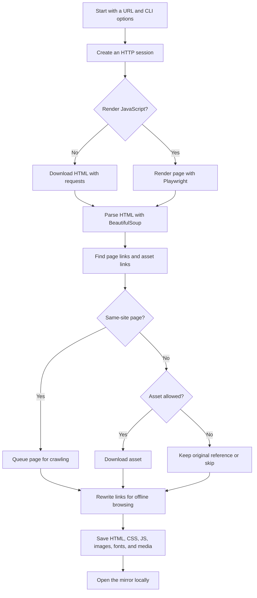

# Website Downloader CLI

[](https://github.com/PKHarsimran/website-downloader/actions/workflows/python-app.yml)
[](https://github.com/PKHarsimran/website-downloader/actions/workflows/lint.yml)
[](https://opensource.org/licenses/MIT)
[](https://www.python.org/)

Website Downloader CLI turns a public or authorized website into a browsable offline copy. It crawls pages, downloads assets, rewrites links, and saves everything into a local folder you can open, inspect, archive, or move into a migration workflow.

It is built for developers who want something more modern and hackable than `wget --mirror`, without jumping straight into a heavy crawler framework.

## Why Use It

| Need | What this tool gives you |
| --- | --- |
| Offline browsing | Saves HTML pages and local asset references that work from disk. |
| Migration prep | Captures the old site before a rebuild, redesign, or host move. |
| Static-site review | Lets you inspect pages, CSS, JS, images, fonts, and media locally. |
| Authenticated snapshots | Reuses cookies for portals, intranets, and staging sites you are allowed to access. |
| Modern asset handling | Understands `srcset`, `data-src`, `poster`, inline styles, CSS imports, meta images, and common JS asset strings. |
| Controlled CDN mirroring | Downloads only the external domains you allow into `cdn/<domain>/...`. |

## Quick Start

```bash
git clone https://github.com/PKHarsimran/website-downloader.git
cd website-downloader

python -m venv .venv
.venv\Scripts\activate
pip install -e .

website-downloader --url https://example.com --destination example_backup --max-pages 100
```

The compatibility script still works too:

```bash
python website-downloader.py --url https://example.com --destination example_backup
```

On macOS or Linux, activate the virtual environment with:

```bash
source .venv/bin/activate
```

## How It Works



In plain English:

1. You give the CLI a starting URL.
2. It downloads or optionally renders each page.
3. It finds links, images, scripts, stylesheets, fonts, media, and metadata assets.
4. It follows same-site pages up to your `--max-pages` limit.
5. It saves assets locally and rewrites references so pages still work offline.
6. It skips unsafe or non-fetchable links like `mailto:`, `tel:`, `javascript:`, and `data:`.

## Common Commands

Mirror a small public site:

```bash
website-downloader ^
  --url https://example.com ^
  --destination example_backup ^
  --max-pages 50
```

Download selected CDN assets:

```bash
website-downloader ^
  --url https://example.com ^
  --destination example_backup ^
  --download-external-assets ^
  --external-domains cdn.example.com fonts.gstatic.com
```

Mirror an authorized site with cookies:

```bash
website-downloader ^
  --url https://intranet.example.com ^
  --destination intranet_backup ^
  --cookie-file example-cookie.txt
```

Cookie files use normal cookie header syntax:

```text
sessionid=abc123; csrftoken=xyz789
```

Use safer crawl limits:

```bash
website-downloader ^
  --url https://example.com ^
  --max-pages 50 ^
  --threads 4 ^
  --delay 0.25 ^
  --respect-robots ^
  --max-asset-bytes 25000000 ^
  --user-agent "WebsiteDownloader/0.2"
```

## JavaScript-Rendered Sites

Some modern sites do not expose their real links and assets until JavaScript runs. For those, install the optional Playwright extra:

```bash
pip install -e ".[render]"
playwright install chromium
website-downloader --url https://example.com --render-js --max-pages 20
```

`--render-js` is optional because it is heavier than the default `requests` + BeautifulSoup path. Use it when a normal crawl only captures an empty app shell or misses important client-rendered links.

## What Gets Rewritten

| Source | Rewritten for offline use |
| --- | --- |
| Page links | `<a href>` for same-site pages |
| Images and media | `src`, `data-src`, `poster`, `srcset` |
| Stylesheets and icons | `<link href>` for fetchable resource types |
| Metadata images | `og:image`, `twitter:image` |
| Inline styles | `style="background: url(...)"` |
| CSS files | `url(...)` and `@import` |
| JavaScript files | Common static asset strings like `/img/logo.png` |
| External assets | Optional CDN copies under `cdn/<domain>/...` |

When external scripts or stylesheets are localized, the tool removes `integrity` and `crossorigin` where needed because those attributes often break offline copies.

## Output Example

```text
example_backup/
  index.html
  about.html
  assets/
    site.css
    app.js
  img/
    logo.png
    hero.webp
  fonts/
    inter.woff2
  cdn/
    cdn.example.com/
      library.js
```

Open `index.html` in your browser to browse the mirrored copy.

## Feature Snapshot

- Same-origin recursive crawling.
- Optional external asset downloading with domain allowlists.
- Cookie-based authenticated crawling.
- Optional JavaScript rendering with Playwright.
- Retry and backoff for unstable requests.
- Worker-thread asset downloads.
- Path sanitization for Windows/macOS/Linux.
- Query-string hashing to avoid filename collisions.
- Long-path fallback handling.
- Local pytest suite and CI checks.

## Local Development

Install the development extra:

```bash
pip install -e ".[dev]"
pytest
black . --check
isort . --check-only
ruff check .
```

### PyCharm

1. Open this repository folder in PyCharm.
2. Create or select a Python 3.10+ virtual environment.
3. In the PyCharm terminal, run `pip install -e ".[dev]"`.
4. Run the `tests` folder with PyCharm's pytest runner.
5. For manual CLI testing, create a Python run configuration for `website_downloader.cli` or run `python website-downloader.py --help`.

## Project Structure

| Path | Purpose |
| --- | --- |
| `website_downloader/cli.py` | Argument parsing, validation, logging, and CLI entry point. |
| `website_downloader/crawler.py` | Crawl coordination, asset queueing, workers, robots.txt support, and stats. |
| `website_downloader/http.py` | Requests sessions, HTML fetches, binary downloads, and downloaded CSS/JS post-processing. |
| `website_downloader/rewrite.py` | HTML, CSS, JavaScript, and `srcset` reference rewriting. |
| `website_downloader/paths.py` | Filesystem-safe page, asset, and CDN path mapping. |
| `website_downloader/render.py` | Optional Playwright page rendering. |
| `tests/` | Local pytest suite with a tiny fixture HTTP server. |

## Roadmap Ideas

These are natural next steps for making the project more useful to developers:

- `--manifest crawl.json` with pages, assets, status codes, titles, headings, and errors.
- `--sitemap` support to crawl from `sitemap.xml`.
- `--header` support for bearer tokens and custom request headers.
- Incremental update mode using `ETag` and `Last-Modified`.
- Zip export for portable snapshots.
- Visual diff mode for migration and redesign checks.

## Responsible Use

Only mirror sites you own, have permission to archive, or are legally allowed to access. Authentication cookies can expose private content, so keep cookie files out of source control and avoid sharing generated mirrors that contain private data. Use `--respect-robots`, lower `--threads`, and `--delay` for polite crawling.

## Licensing And Ownership

This project is licensed under the MIT License. Others may use, copy, modify, and distribute the code if they keep the license notice. Your original code remains your copyrighted work, but the MIT license intentionally allows broad reuse.

If the project becomes a product, consider choosing a distinctive brand name and protecting that brand separately from the source code license.

## Support This Project

[Donate via PayPal](https://www.paypal.com/donate/?business=PJVPSXG6V4CUG&no_recurring=1&item_name=Thank+you+for+the+coffee+%3A%29&currency_code=CAD)

## Contributing

Contributions are welcome. Please open an issue or pull request for bug reports, feature ideas, or improvements.

## License

This project is licensed under the MIT License.
