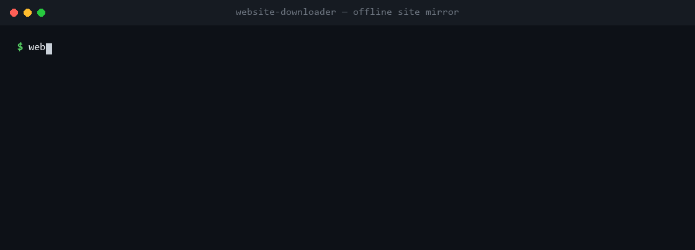
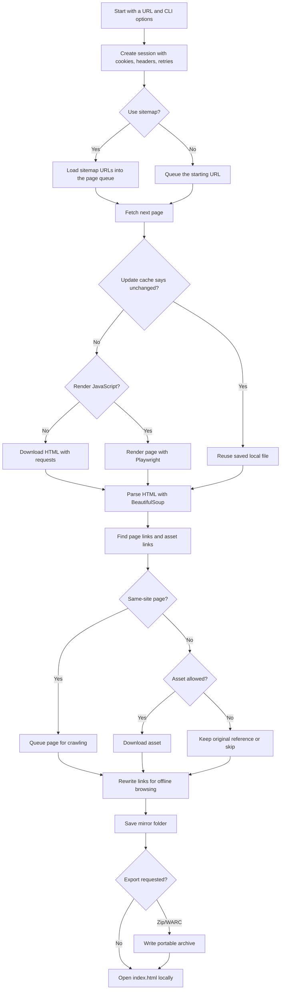

<div align="center">

# 🌐 Website Downloader CLI

**Turn any website you're authorized to copy into a fast, browsable offline mirror — with one command.**

[](https://github.com/PKHarsimran/website-downloader/actions/workflows/python-app.yml)
[](https://github.com/PKHarsimran/website-downloader/actions/workflows/lint.yml)
[](https://www.python.org/)
[](https://opensource.org/licenses/MIT)
[](https://github.com/PKHarsimran/website-downloader/commits/main)
[](https://github.com/PKHarsimran/website-downloader/pulls)

*A modern, hackable alternative to `wget --mirror` and HTTrack — built in pure Python, without dragging in a heavy crawler framework.*

</div>

---

<div align="center">



</div>

Open `example_backup/index.html` in your browser — the whole site works from disk: pages, styles, scripts, images, fonts, and media, all with links rewritten for offline browsing.

## ⚡ Quick Start

```bash
git clone https://github.com/PKHarsimran/website-downloader.git
cd website-downloader

python -m venv .venv
.venv\Scripts\activate        # macOS/Linux: source .venv/bin/activate
pip install -e .

website-downloader --url https://example.com --destination example_backup --max-pages 100
```

The classic script entry point still works too:

```bash
python website-downloader.py --url https://example.com --destination example_backup
```

## 🤔 Why Not Just wget or HTTrack?

Those tools are great — until you hit a modern website. This project exists for the gap between "one-liner that misses half the assets" and "write your own Scrapy project."

| | **website-downloader** | wget --mirror | HTTrack | Scrapy |
| --- | :-: | :-: | :-: | :-: |
| Modern assets: `srcset`, `data-src`, `poster`, CSS `@import`, JS asset strings | ✅ | partial | partial | build it yourself |
| JavaScript rendering (React, Vue, Next.js) | ✅ Playwright | ❌ | ❌ | plugin |
| Incremental re-mirroring (`ETag` / `Last-Modified`) | ✅ | timestamps only | ✅ | manual |
| Cookies + custom headers for authorized portals | ✅ | ✅ | ✅ | ✅ |
| Selective CDN mirroring with a domain allowlist | ✅ | ❌ | partial | manual |
| Zip + WARC export | ✅ | WARC ✅ | ❌ | manual |
| Windows-safe paths (long paths, reserved names, query hashing) | ✅ | ❌ | partial | manual |
| Small, readable Python codebase you can extend | ✅ | ❌ (C) | ❌ (C) | framework |

## ✨ Highlights

- 🚀 **Fast** — parallel page fetching (`--page-threads`, ~3–4× faster on multi-page sites), threaded asset downloads, and optional lxml parsing (`pip install -e ".[fast]"`).
- 🔁 **Incremental** — `--update` skips unchanged pages and assets using `ETag`/`Last-Modified`, perfect for recurring archives.
- ⚛️ **JavaScript-aware** — optional Playwright rendering for client-rendered sites (`--render-js`).
- 🍪 **Authenticated** — reuse browser cookies and custom headers for portals, intranets, and staging sites you're allowed to access.
- 🧭 **Sitemap seeding** — start from `sitemap.xml` (including nested sitemap indexes) for complete discovery.
- 📦 **Portable output** — export mirrors as zip archives or WARC 1.1 response records.
- 🤝 **Polite by default** — sequential pages unless you opt in, `--respect-robots`, `--delay`, retry with backoff, and per-asset size caps.
- 🪟 **Cross-platform paths** — sanitizes Windows reserved names, shortens long paths, and hashes query strings to avoid collisions.
- 🧪 **Tested** — pytest suite running against a real local HTTP fixture server, with CI and lint gates.

## 🛠 How It Works



In plain English:

1. You give the CLI a starting URL and optional crawl settings.
2. It can seed pages from `sitemap.xml`, custom headers, cookies, and robots rules.
3. It downloads or optionally renders each page with Playwright.
4. It finds links, images, scripts, stylesheets, fonts, media, and metadata assets.
5. It follows same-site pages up to your `--max-pages` limit.
6. It saves assets locally and rewrites references so pages still work offline.
7. With `--update`, unchanged resources are skipped using cache metadata.
8. With `--zip-output` or `--warc-output`, the result is also exported as an archive.

## 📦 Install Options

Start with the core install, then add extras only when you need them:

| Install | Use when you want |
| --- | --- |
| `pip install -e .` | Normal static-site crawling with `requests` and BeautifulSoup. |
| `pip install -e ".[fast]"` | Faster HTML parsing with lxml (used automatically when installed). |
| `pip install -e ".[render]"` | Playwright-powered JavaScript rendering with `--render-js` or `--headless`. |
| `pip install -e ".[ux]"` | Rich-powered terminal progress with `--progress`. |
| `pip install -e ".[dev]"` | Tests, formatting, linting, and local contributor work. |

## 📖 Cookbook

Mirror a small public site:

```bash
website-downloader ^
  --url https://example.com ^
  --destination example_backup ^
  --max-pages 50
```

Speed up a large mirror with parallel page fetching:

```bash
website-downloader ^
  --url https://example.com ^
  --max-pages 500 ^
  --page-threads 4
```

`--page-threads` defaults to 1 so crawls stay polite; raise it only for sites that can handle concurrent requests. `--render-js` always uses a single page worker.

Download selected CDN assets:

```bash
website-downloader ^
  --url https://example.com ^
  --destination example_backup ^
  --download-external-assets ^
  --external-domains cdn.example.com fonts.gstatic.com
```

Mirror an authorized site with cookies:

```bash
website-downloader ^
  --url https://intranet.example.com ^
  --destination intranet_backup ^
  --cookie-file example-cookie.txt
```

Cookie files use normal cookie header syntax:

```text
sessionid=abc123; csrftoken=xyz789
```

Send custom headers such as bearer tokens:

```bash
website-downloader ^
  --url https://docs.example.com ^
  --destination docs_backup ^
  --header "Authorization: Bearer <token>" ^
  --header "X-Environment: staging"
```

Use a sitemap as the crawl seed:

```bash
website-downloader ^
  --url https://example.com ^
  --destination example_backup ^
  --sitemap
```

Point at a custom sitemap URL or local sitemap file:

```bash
website-downloader --url https://example.com --sitemap https://example.com/sitemap.xml
```

Use safer crawl limits:

```bash
website-downloader ^
  --url https://example.com ^
  --max-pages 50 ^
  --threads 4 ^
  --delay 0.25 ^
  --respect-robots ^
  --max-asset-bytes 25000000 ^
  --user-agent "WebsiteDownloader/0.2"
```

Update an existing mirror without re-downloading unchanged resources:

```bash
website-downloader ^
  --url https://example.com ^
  --destination example_backup ^
  --update
```

Export a portable zip and WARC archive:

```bash
website-downloader ^
  --url https://example.com ^
  --destination example_backup ^
  --zip-output example_backup.zip ^
  --warc-output example_backup.warc
```

## ⚛️ JavaScript-Rendered Sites

Some modern sites do not expose their real links and assets until JavaScript runs. For those, install the optional Playwright extra:

```bash
pip install -e ".[render]"
playwright install chromium
website-downloader --url https://example.com --render-js --max-pages 20
```

`--headless` is also available as a friendly alias for `--render-js`.

`--render-js` and `--headless` are optional because Playwright is heavier than the default `requests` + BeautifulSoup path. Use them when a normal crawl only captures an empty app shell or misses important client-rendered links.

## 📊 Live Progress

Install the optional UX extra for a Rich-powered terminal dashboard:

```bash
pip install -e ".[ux]"
website-downloader --url https://example.com --progress
```

If `rich` is not installed, the crawler falls back to normal logging instead of failing.

## 🎛 Feature Flags At A Glance

| Flag | What it does | Best for |
| --- | --- | --- |
| `--page-threads` | Fetches HTML pages concurrently (default 1). | Faster mirroring of large sites that tolerate concurrent requests. |
| `--render-js` / `--headless` | Uses Playwright before parsing the page. | React, Vue, Angular, Next.js, and other client-rendered sites. |
| `--cookie-file` | Sends saved browser/session cookies. | Authorized portals, staging sites, docs behind login. |
| `--header` | Adds custom request headers. | Bearer tokens, staging headers, API gateway headers. |
| `--update` | Reuses cache metadata and skips unchanged resources when the server supports it. | Recurring mirrors and archives. |
| `--sitemap` | Seeds the crawl from `sitemap.xml` or a supplied sitemap. | Faster, more complete discovery. |
| `--progress` | Shows a Rich terminal progress dashboard when installed. | Long crawls where visibility matters. |
| `--zip-output` | Exports the mirror folder as a zip. | Sharing, attaching, or storing snapshots. |
| `--warc-output` | Writes a simple WARC response archive. | Archival workflows and future replay tooling. |

## 🔁 What Gets Rewritten

| Source | Rewritten for offline use |
| --- | --- |
| Page links | `<a href>` for same-site pages |
| Images and media | `src`, `data-src`, `poster`, `srcset` |
| Stylesheets and icons | `<link href>` for fetchable resource types |
| Metadata images | `og:image`, `twitter:image` |
| Inline styles | `style="background: url(...)"` |
| CSS files | `url(...)` and `@import` |
| JavaScript files | Common static asset strings like `/img/logo.png` |
| External assets | Optional CDN copies under `cdn/<domain>/...` |

When external scripts or stylesheets are localized, the tool removes `integrity` and `crossorigin` where needed because those attributes often break offline copies.

## 📁 Output Example

```text
example_backup/
  index.html
  about.html
  assets/
    site.css
    app.js
  img/
    logo.png
    hero.webp
  fonts/
    inter.woff2
  cdn/
    cdn.example.com/
      library.js
```

Open `index.html` in your browser to browse the mirrored copy.

## 🧑‍💻 Development

```bash
pip install -e ".[dev]"
pytest
black . --check
isort . --check-only
ruff check .
```

Using PyCharm? Open the repo folder, point it at a Python 3.10+ virtualenv, run `pip install -e ".[dev]"` in the terminal, and use the pytest runner on the `tests` folder.

<details>
<summary><b>Project structure</b></summary>

| Path | Purpose |
| --- | --- |
| `website_downloader/cli.py` | Argument parsing, validation, logging, and CLI entry point. |
| `website_downloader/crawler.py` | Crawl coordination, page/asset worker pools, robots.txt support, and stats. |
| `website_downloader/http.py` | Requests sessions, HTML fetches, binary downloads, and downloaded CSS/JS post-processing. |
| `website_downloader/rewrite.py` | HTML, CSS, JavaScript, and `srcset` reference rewriting. |
| `website_downloader/paths.py` | Filesystem-safe page, asset, and CDN path mapping. |
| `website_downloader/render.py` | Optional Playwright page rendering. |
| `website_downloader/cache.py` | Update-mode metadata for `ETag` and `Last-Modified`. |
| `website_downloader/sitemap.py` | Sitemap and sitemap-index loading. |
| `website_downloader/progress.py` | Optional Rich progress dashboard. |
| `website_downloader/exports.py` | Zip and WARC export helpers. |
| `tests/` | Local pytest suite with a tiny fixture HTTP server. |

</details>

## 🗺 Roadmap

- `--manifest crawl.json` with pages, assets, status codes, titles, headings, and errors.
- Login-flow recording for complex SSO sites.
- Stronger WARC metadata and replay compatibility.
- Visual diff mode for migration and redesign checks.

Have an idea? [Open an issue](https://github.com/PKHarsimran/website-downloader/issues) — feature requests and bug reports are very welcome.

## 🛡 Responsible Use

Only mirror sites you own, have permission to archive, or are legally allowed to access. Authentication cookies can expose private content, so keep cookie files out of source control and avoid sharing generated mirrors that contain private data. Use `--respect-robots`, lower `--threads`, and `--delay` for polite crawling.

## 🤝 Contributing

Contributions are welcome! Open an issue or pull request for bug reports, feature ideas, or improvements. The codebase is intentionally small and modular — most features live in a single focused module, so it's an easy project to hack on.

If this tool saved you time, consider **starring the repo** ⭐ — it helps others find it.

## ☕ Support This Project

[Donate via PayPal](https://www.paypal.com/donate/?business=PJVPSXG6V4CUG&no_recurring=1&item_name=Thank+you+for+the+coffee+%3A%29&currency_code=CAD)

## 📄 License

MIT — use it, fork it, ship it. See [LICENSE](LICENSE) for details.
